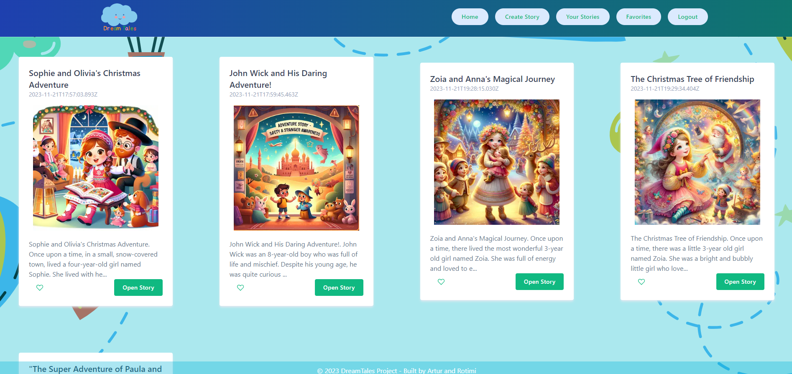

# DreamTales 
Deployed - [https://dream-tales-90c0129deeec.herokuapp.com/](https://dream-tales-90c0129deeec.herokuapp.com/) <br/>
For an easy and quick trial, use the following credentials: <br/>
Email: test@g.com<br/>
Password: 1234
___
This repository consists of a full-stack application that utilizes [NEXT.js](https://nextjs.org/) for both front-end and back-end,  [PostgreSQL](https://www.postgresql.org/) for the database. It integrates [OpenAI](https://platform.openai.com/overview) technologies and APIs and is deployed on [Heroku](https://www.heroku.com/). Additionally, it employs [Google Cloud Storage](https://cloud.google.com/?hl=en) for storing and displaying generated images. All are styled using [Tailwind](https://tailwindcss.com/) and Vanilla CSS.<br/>
For a localhost repository version - visit ```localhostVesrion``` branch and follow the installing instructions there.
___
### Introducing DreamTales - Where Imagination Comes to Life!
Are you tired of reading the same old bedtime stories night after night? Do you struggle to come up with new, creative tales for your little one? Do you want your child to be the star of their own adventure? Look no further - we've got you covered!
Welcome to DreamTales, the ultimate personalized kids' story app. We understand that every child is unique and deserves stories as special as they are. With DreamTales, you'll embark on a journey of imagination, discovery, and learning, all tailored to your child's interests and preferences.
How does it work? It's as easy as 1-2-3:
- Create an account: to have access to all your previously generated stories and images.
- Create Your Hero: Enter your child's name, and age, and even select a style for the story. Whether it's a magical adventure, a hilarious escapade, or a heartwarming tale, you're in control.
- Choose Your Adventure: Pick an educational topic that aligns with your child's developmental needs. From teaching friendship to promoting dental hygiene or potty training, our stories are not only entertaining but also educational.
- Add Special Characters: Make the story even more exciting by adding characters like siblings, friends, and parents! Your child will love seeing their loved ones as part of their bedtime journey.
But what's a story without visuals? We've got that covered too! Our app goes above and beyond ```by generating a one-of-a-kind illustration for every story```. No more generic images - each picture is crafted to match your child's story, making their DreamTale experience truly unforgettable.
Explore Endless Possibilities: With DreamTales, there's no limit to the stories you can enjoy. Every adventure is fresh, exciting, and designed to captivate young minds.
Boost Imagination and Learning: Our stories aren't just about entertainment; they're about nurturing creativity, improving reading skills, and imparting valuable life lessons about kindness, friendship, and more.
As we embark on this magical storytelling journey, we're not just creating an app - we're creating memories. Join us in redefining bedtime stories, one DreamTale at a time. Let's make every night an enchanting experience filled with wonder, laughter, and learning. Dream big with DreamTales!
### Demo

### Home Page

### Create Story Page

### You Stories

### Logo

## Dependencies
Ensure that you have the following dependencies installed and properly configured:
- `bcrypt` (^5.1.0): Password hashing library
- `bcryptjs` (^2.4.3): Alternative password hashing library
- `cookie` (^0.5.0): Library for handling HTTP cookies
- `cookie-parser` (^1.4.6): Middleware for parsing cookies
- `jsonwebtoken` (^9.0.1): Library for creating and verifying JSON Web Tokens (JWT)
- `next` (13.4.12): React framework for server-rendered applications
- `openai` (^3.3.0): OpenAI API client for integration
- `pg` (^8.11.1): PostgreSQL client for Node.js
- `react` (18.2.0): JavaScript library for building user interfaces
- `react-cookie` (^4.1.1): Library for handling cookies in React applications
- `react-dom` (18.2.0): Entry point for rendering React components
## Development Dependencies
The following development dependencies are used for building and styling the app:
- `autoprefixer` (^10.4.14): PostCSS plugin to parse CSS and add vendor prefixes
- `postcss` (^8.4.27): Tool for transforming CSS with JavaScript
- `tailwindcss` (^3.3.3): Utility-first CSS framework


## [OpenAI](https://platform.openai.com/overview) models
- `text-davinci-003` model for generating text;
- `dall-e-3` model for image generation;

### What was used:
* [Canva](https://www.canva.com/) - for web design, logo, backgrounds
* [Coolors](https://coolors.co/) - to generate the color schemas
* [Wind UI](https://wind-ui.com/) - Tailwind CSS library. Just copy and paste them on your Tailwind CSS project.
* [Haikei](https://app.haikei.app/) - Generate unique SVG design assets. For background generation
* [LICEcap](https://www.cockos.com/licecap/) - simple animated screen capture tool for Windows and OS X
---
### Added: 
- updated img generate model to Dall-E 3
- Responsive design added + UA language
### Future development:
- Interactive Adventures:  guide your child through interactive stories where their choices shape the outcome. 
- audio storytelling option will read the stories aloud, so you can relax while your child explores.
- Add picture styles options.
___
Created by [Artur](https://github.com/mr-Arturio) & [Rotimi](https://github.com/osuntol)
